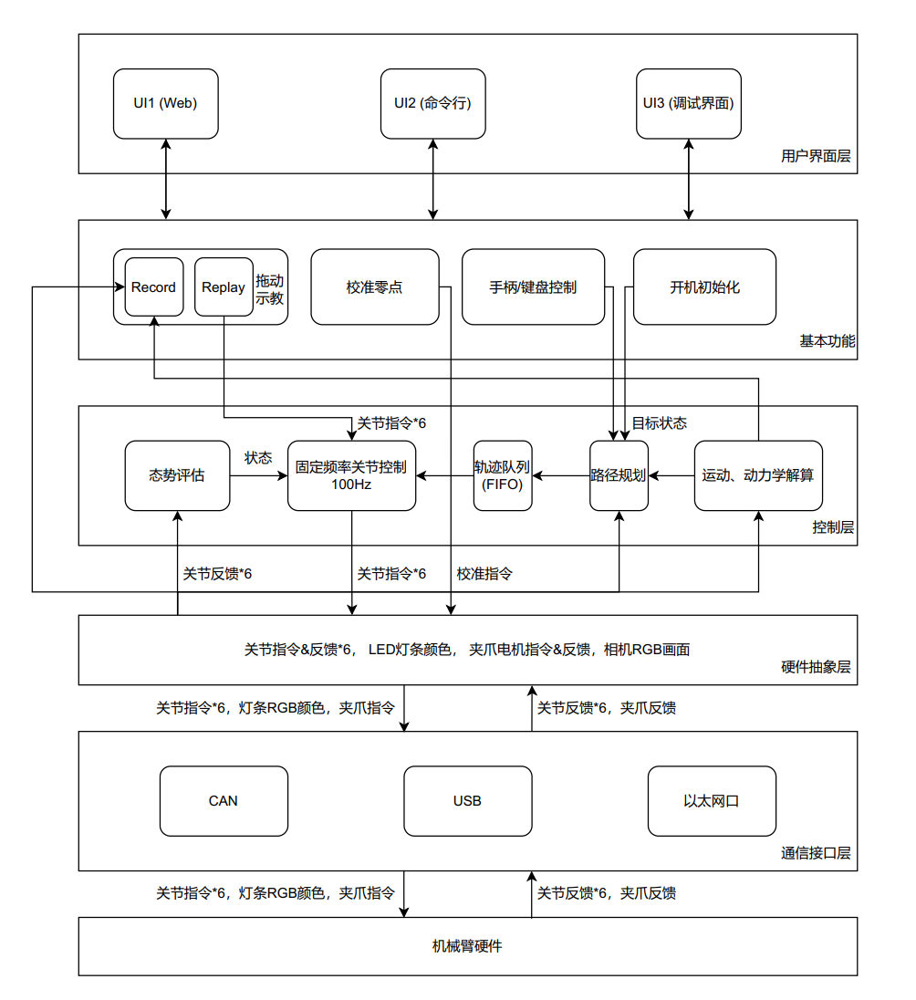

# libarx5

## Warning!!!
Remember to change the file path in teaching.cpp and kinematics_dynamics.cpp!!!
Remember to change the file path in teaching.cpp and kinematics_dynamics.cpp!!!
Remember to change the file path in teaching.cpp and kinematics_dynamics.cpp!!!

## Dependencies

```sh
# Ubuntu 20.04
sudo apt-get install liborocos-kdl1.4 libkdl-parser-dev

# Ubuntu 22.04
sudo apt-get install liborocos-kdl-dev libkdl-parser-dev
```

## Open USB2CAN

```sh
sudo ip link set can0 type can bitrate 1000000
sudo ifconfig can0 up
```

## Software Architecture


## TODO List

* HardwareInterface ✓
* Rate ✓
* JointTrajectories ✓
* Kinematics ✓ Dynamics ✗
* StateEstimation ✓
* Teaching ✗
* Calibration ✗
* Teleop ✗
* Initialization ✗
* UI ✗